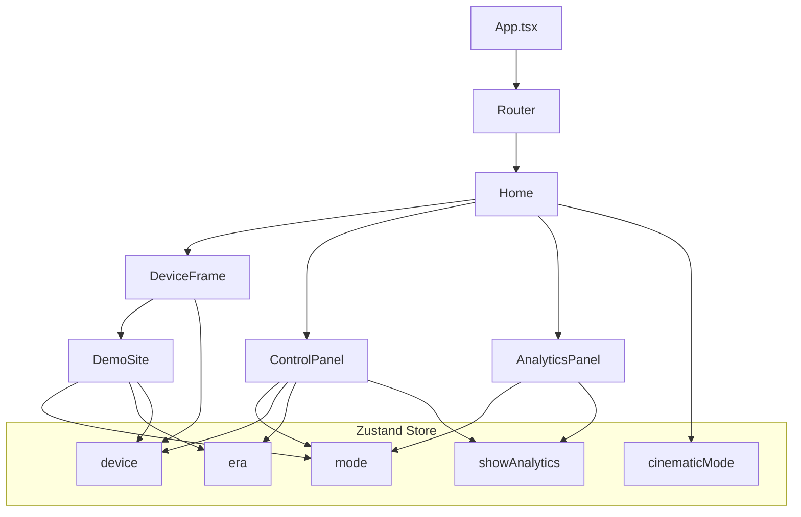

# Responsiv.ai — Interactive Responsive Design Demo

A cinematic, client‑side demo that visualizes how responsive design impacts UX, conversions, and brand perception across devices and eras.

## ✨ Highlights
- **Three responsiveness modes**: no‑responsive, bad‑responsive, perfect‑responsive.
- **Three eras**: 2010 / 2020 / 2026 styling for the same commerce layout.
- **Device frame simulation**: mobile, tablet, desktop previews.
- **Live analytics**: animated metrics reacting to mode changes.
- **Modern UI**: Tailwind + shadcn/ui, cinematic visuals, smooth motion.

## 🧰 Tech Stack
- **Framework**: React 18 + Vite + TypeScript
- **State**: Zustand
- **Routing**: Wouter
- **UI**: Tailwind CSS, shadcn/ui (Radix primitives)
- **Motion**: Framer Motion
- **Charts**: Recharts
- **Forms**: React Hook Form + Zod
- **Data**: TanStack Query (client‑side only)

## 🗂 Project Structure
```
client/
  index.html            # SEO meta, favicon, fonts
  public/
    favicon.svg         # Custom R icon
  src/
    App.tsx             # Providers + routing
    main.tsx            # React entry
    pages/
      Home.tsx          # Main layout + header + frame + panels
      not-found.tsx     # 404
    components/
      DeviceFrame.tsx   # Device frame + scroll container
      DemoSite.tsx      # Demo commerce site (era + mode)
      ControlPanel.tsx  # Mode/device/era controls
      AnalyticsPanel.tsx# Live metrics panel
      ui/               # shadcn/ui components
    hooks/
      use-store.ts      # Zustand state
      use-leads.ts      # Local form submit simulation
      use-toast.ts      # Toast system
    lib/
      leadSchema.ts     # Zod schema
      queryClient.ts    # React Query config
      utils.ts          # className helper
```

## 🧠 Logic Map (Interactive)


## ⚙️ Setup & Run
```zsh
npm install
npm run dev
```

## 🔎 Behavior Notes
- **Mode inversion in DemoSite**: visual mapping for bad/perfect can be inverted for demo effect while controls still show the selected mode.
- **Desktop scrolling**: the frame is height‑constrained so the demo site scrolls internally.

## ✅ SEO & Assets
- Meta tags and social previews are defined in `client/index.html`.
- Favicon uses `client/public/favicon.svg` (custom “R” icon).

## 🧩 Customization Ideas
- Add a real `og-image.png` for richer social cards.
- Extend `DemoSite` with additional sections (testimonials, FAQ, pricing).
- Wire the lead form to a real endpoint.

---
If you want a more detailed component diagram or API‑style docs, tell me what to focus on.
